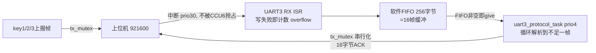

# 串口收发修复记录

> 日期：2026-08-16
> 背景：上位机快速连续发送时丢包，且上位机无法感知丢包。
> 结论：修复从机侧 4 个丢包点与 2 处临界区冲突，启用响应帧；响应帧格式与内容**未做任何修改**。

---

## 1. 问题根因

| # | 位置 | 问题 |
|---|------|------|
| 1 | `bsp_uart.c` ISR | RX FIFO 仅 64 字节（4 帧缓冲），写满时 `fifo_write_buffer` 返回错误被忽略，字节**静默丢弃** |
| 2 | `isr_config.h` | UART3 RX 中断优先级 20，低于 CCU6 CH0(24)/CH1(25) 且开启中断嵌套；硬件 RX 缓冲仅 1 字节，ISR 被延迟超过 1 字节时间即硬件溢出 |
| 3 | `uart_protocol.c` | 帧头扫描一次读 2 字节、失配丢 2 字节，失步后奇数偏移的帧永远扫不到帧头 → 连环丢帧 |
| 4 | `uart_protocol.c` | 每唤醒一次只解析 1 帧，二值信号量 + `>=16` 唤醒条件导致积压只能跟随新字节慢速消化 |
| 5 | `hardware_config.h` | `PROTOCOL_DISABLE_RESPONSE` 已定义，所有响应被编译期剔除，上位机无任何反馈 |
| 6 | 协议设计 | 帧内无序号字段，上位机无法检测丢帧/错位，无重传机制 |

---

## 2. 修改清单

| 文件 | 改动内容 |
|------|----------|
| `code/User/App/hardware_config.h` | 注释 `PROTOCOL_DISABLE_RESPONSE`，启用响应帧 |
| `code/User/Bsp/bsp_uart.h` | `rx_buffer` 128→**256**；新增 `tx_mutex`（发送互斥锁）、`rx_overflow_count`（溢出丢字节计数） |
| `code/User/Bsp/bsp_uart.c` | ① ISR 检查 `fifo_write_buffer` 返回值，写满丢字节累计到 `rx_overflow_count`；② 唤醒条件 `>=16` 改为 `>=1`；③ 三个发送函数统一持 `tx_mutex`；④ `bsp_uart_recv` 内加 `disableInterrupts()` 短临界区；⑤ UART3 FIFO 参数 64→256；⑥ **UART3 波特率 115200→921600** |
| `code/User/Protocol/uart_protocol.c` | `uart_protocol_poll` 重写：逐字节状态机扫描帧头（失步每次只丢 1 字节）+ 唤醒后循环解析直到 FIFO 不足一帧 |
| `code/User/Service/isr_config.h` | UART3 RX 中断优先级 20→**30**、ER 21→**31**（高于 CCU6 的 24/25；须 ≤31 才能调用 `xSemaphoreGiveFromISR`） |
| `code/User/App/app_cfg.c` | `fputc` 由直接 `uart_write_byte(UART_3, …)` 改为经 `bsp_uart_send_byte`（纳入发送互斥锁） |

**响应帧未改**：`protocol_send_response`、`protocol_send_query_speed`、`protocol_send_query_servo_angle` 三个函数的帧格式、数据内容与 `串口协议.md` 第 5 节示例完全一致，本次仅使其从"被宏剔除"变为"实际编译执行"。

---

## 3. 修复后的数据通路

---

## 4. 发送方向临界区（本次新增互斥）

打开响应后，UART3 存在 4 类并发发送者，`uart_write_byte` 逐字节忙等发送本身无帧级原子性，原代码存在字节交错风险：

| 发送者 | 任务优先级 | 说明 |
|--------|-----------|------|
| 协议响应帧/查询响应 | 4 | 16 字节，阻塞发送 ≈0.17 ms（921600） |
| key1/2/3 执行上报帧 | 3 | 16 字节 |
| `printf`（经 `fputc`） | 不定 | 调试输出 |
| `test_task` 测试打印 | 5 | 仅 `TEST_BOARD` 时 |

处理：所有 BSP 层发送函数统一持 `tx_mutex`（带优先级继承），`fputc` 改走 BSP 层。

约束：
- mutex 仅在任务上下文获取，RX ISR 不发送 → 无 ISR 死锁；
- BSP 发送函数无相互嵌套调用 → 无递归自锁；
- **禁止在中断服务函数中调用 `printf`**（会阻塞卡死）。

---

## 5. 接收方向临界区（本次修复）

逐飞 FIFO 的 `size` 字段在 ISR（写，`size -= n`）与任务（读，`size += n`）之间是非原子 read-modify-write；中断嵌套开启时 RX 中断可能打断任务内的 `fifo_read_buffer`，导致 `size` 错乱。

处理：`bsp_uart_recv` 内以 `disableInterrupts()/restoreInterrupts()` 包住读操作（memcpy 仅几十 ns，全局关中断影响可忽略）。`bsp_uart_available` 为单次 32 位读，天然原子，无需保护。

---

## 6. 上位机侧配合要求

1. 发送设置/查询帧后**等待 ACK**，超时（建议 50~100 ms）未收到则重传；
2. 连续发送建议帧间隔 ≥ 0.5 ms（921600 下 1 帧约 0.17 ms）；
3. 响应帧内当前**无序号**，连发场景下若丢一帧，后续 ACK 会与请求错位对应，上位机需按"先发先得"配对或后续由协议增加 seq 字段；
4. 从机 `bsp_uart3.rx_overflow_count` 非零即表示发生过 FIFO 溢出丢字节，可用于现场诊断（暂未接入查询命令）。

---

## 7. 遗留事项

| 项 | 说明 |
|----|------|
| 协议无序号 | 建议后续在数据区首位增加 seq 字段，响应携带 seq，彻底解决 ACK 与请求的对应问题 |
| 溢出计数未上报 | 建议增加一条状态查询命令，把 `rx_overflow_count` 上报给上位机形成闭环 |
| 中断优先级上限 | UART3 中断优先级不能超过 31（`configMAX_SYSCALL_INTERRUPT_PRIORITY`），当前 30/31 已接近上限 |
| 921600 波特率开销 | 每字节中断一次（≈92 kHz）；1 字节 10.85 ?s，256 字节 FIFO 缓冲时间仅 ≈2.78 ms，需保证协议任务及时消费；逐飞库 ascFastClock 最大 6.25M，921600 在支持范围内 |
| FIFO 内存 | `BspUart` 每实例 256 字节缓冲 ×4 实例 ≈ 1 KB（位于 `cpu0_dsram`），同时修复了原 UART1 传参 256 但缓冲仅 128 的越界隐患 |
