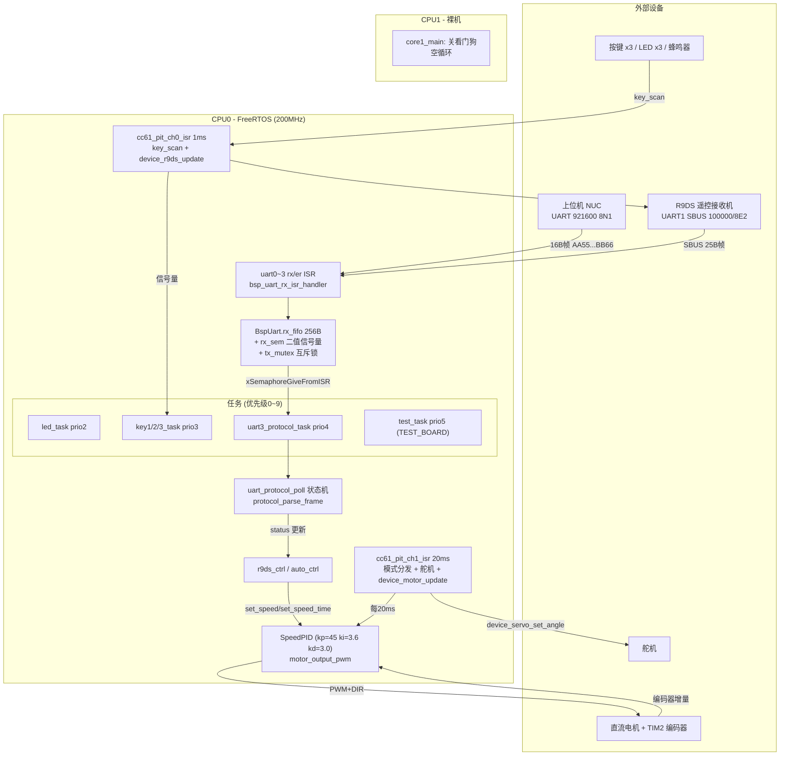

# TC264_FreeRTOS_Demo 逆向分析技术报告

## 1. 项目概述

**项目定位**：全国大学生智能汽车竞赛（第21届完全模型组）车模控制固件，车模为百度 I 型，主控为 Infineon AURIX TC264 双核 MCU（依据 `README.md` 头部与第 1 节）。代码与硬件继承自第 20 届 Car_car 工程，本工程重新整理目录结构并移植 FreeRTOS（`README.md` 第 1 节）。

**主要功能**（依据 `README.md` 第 3、4 节及源码）：
- 双控制源：R9DS 遥控器（SBUS，手动模式）与上位机 UART 协议（自动模式），由遥控器 S3 三段开关切换；
- 直流电机速度环 PID 控制（编码器反馈）与舵机 PWM 角度控制；
- 按键/蜂鸣器/LED 板级外设与板级测试模式；
- 16 字节固定帧 UART 协议实现上下位机通信（`code/User/Protocol/uart_protocol.c`）。

**运行形态**：
- CPU0 运行 FreeRTOS（任务调度 + 中断服务），CPU1 裸机空循环（`code/User/App/cpu1_main.c` 的 `core1_main`：关闭看门狗、开全局中断、`cpu_wait_event_ready()` 后 `while(1)`）；
- 双核启动经 `cpu_wait_event_ready()` 同步（`cpu0_main.c`、`cpu1_main.c` 均调用）；
- 构建产物为 ELF，工程为 AURIX Development Studio（Eclipse CDT）工程（`.project`、`.cproject`、`TC264_FreeRTOS_Demo Debug.launch`）。

## 2. 技术栈

| 类别 | 内容 | 依据 |
|------|------|------|
| 语言 | C（工程源码均为 .c/.h，含 `#pragma section all` 编译指令） | `code/User/**/*.c` |
| RTOS | FreeRTOS Kernel **V10.4.3** | `code/OS/FreeRTOS/tasks.c` 头部注释 |
| 硬件平台 | Infineon AURIX TC264（tc26xB，BGA292 封装） | `.cproject`：`com.tasking.ctc.cpu` 值 `tc26xb`、`com.tasking.ctc.package` 值 `bga292` |
| 编译器/工具链 | TASKING C/C++ Compiler（Tricore 架构） | `.cproject`：toolChain `com.infineon.aurix.buildsystem.managed.toolChain.tasking.exe.binary`，工具 `TASKING C/C++ Compiler`；链接脚本 `Lcf_Tasking_Tricore_Tc.lsl`（derivative `tc26B`，reset 入口 `0x80000020`） |
| IDE/构建 | AURIX Development Studio（Eclipse CDT + GNU Make 构建器） | `.cproject` 中 builder 为 GNU Make（并行构建）；`.ads/winIDEAWorkspaces/` 表明调试器为 winIDEA |
| 底层驱动库 | 逐飞（Zhuofei）通用库 `zf_common`、驱动库 `zf_driver`；Infineon iLLD 库 `infineon_libraries` | `libraries/` 目录结构 |
| 调试工具 | vofa+（JustFloat 协议波形）、串口助手 | `code/User/App/motor_report_task.c` 注释与实现 |
| 数据库/第三方服务 | 无 | 工程内未发现相关代码（待确认） |
| 版本控制 | Git（仓库 `Rh-i/TC264_FreeRTOS_Demo`，分支 main） | `.git/`、仓库信息 |

**关键配置项**（`code/User/Service/FreeRTOSConfig.h`）：
- `configCPU_CLOCK_HZ = 200000000`（200 MHz）、`configTICK_RATE_HZ = 1000`（1 ms tick）；
- `configMAX_PRIORITIES = 10`（任务优先级 0~9）、`configTOTAL_HEAP_SIZE = 64 KB`；
- `configSTM_MODULE = AURIX_STM0`、`configSTM_CLOCK_HZ = configCPU_CLOCK_HZ/2`（100 MHz）；
- `configMAX_SYSCALL_INTERRUPT_PRIORITY = 31`、`configKERNEL_INTERRUPT_PRIORITY = 1`；
- `configASSERT(x)`：失败时关中断、`TriCore__debug()`、死循环；
- 内存管理为 `heap_4.c`（`Debug/heap_4.d` 存在于构建产物中）。

**逐飞库/工具链具体版本号**：工程内未记录，待确认。

## 3. 系统架构

**架构风格**：嵌入式分层架构 + 前后台/RTOS 混合 + 事件驱动（信号量、队列、中断）。自底向上为：Libraries → OS → Bsp → Device → Module → Protocol → App/Service（`README.md` 第 2 节定义三层：OS 层、User 层、Libraries 层；User 层内再分 Bsp/Device/Module/Protocol/App/Service/Algorithm）。

**模块划分与职责**：

| 模块 | 职责 | 关键文件 |
|------|------|----------|
| App | 双核入口、全局初始化、任务定义、硬件配置宏、板级测试 | `code/User/App/cpu0_main.c`、`cpu1_main.c`、`app_cfg.c/h`、`hardware_config.h`、`test.c/h`、`motor_report_task.c/h` |
| Service | 中断服务函数与中断优先级配置 | `code/User/Service/isr.c`、`isr_config.h` |
| Protocol | 上下位机 16 字节帧协议（状态机解析、命令处理、响应） | `code/User/Protocol/uart_protocol.c/h` |
| Module | 控制逻辑：遥控控制 `r9ds_ctrl`、自动控制 `auto_ctrl` | `code/User/Module/r9ds_ctrl.c/h`、`auto_ctrl.c/h` |
| Device | 设备抽象：电机、舵机、R9DS(SBUS) | `code/User/Device/device_motor.c/h`、`device_servo.c/h`、`device_r9ds.c/h` |
| Bsp | 板级驱动：UART、编码器、PWM、IO(按键/LED/蜂鸣器)、FreeRTOS 启动 | `code/User/Bsp/bsp_uart.c/h`、`bsp_encoder.c/h`、`bsp_pwm.c/h`、`bsp_io.c/h`、`bsp_freertos_cpu0.c/h` |
| Algorithm | PID 控制器（基础 + 速度环封装） | `code/User/Algorithm/pid.c/h`、`pid_speed.c/h` |
| OS | FreeRTOS 内核与 TriCore 移植 | `code/OS/FreeRTOS/`（tasks.c、queue.c、timers.c、portable/TriCore、MemMang） |

**模块间依赖关系**（依据 include 关系）：`app_cfg.h` 汇总包含 `bsp_io.h`、`bsp_uart.h`、`uart_protocol.h`、`bsp_encoder.h`、`bsp_pwm.h`、`device_motor.h`、`device_servo.h`、`device_r9ds.h`、`auto_ctrl.h`、`r9ds_ctrl.h`。方向：App → Module → Device → Bsp；Protocol 依赖 Bsp(`bsp_uart`)；Module 依赖 Protocol（`auto_ctrl.c` 调用 `uart_protocol_get_status`）；Bsp/Device 依赖 FreeRTOS 信号量 API（`bsp_io.h`、`bsp_uart.h` 均 include `semphr.h`）。

## 4. 核心任务逻辑

### 4.1 控制权切换（核心状态机）

`R9DS_CtrlMode` 三态（`code/User/Module/r9ds_ctrl.h`）：
- `R9DS_CTRL_MODE_MANUAL`(S3=1)：遥控接管，20ms ISR 调 `r9ds_ctrl_update`；
- `R9DS_CTRL_MODE_NONE`(S3=2)：刹停 + 舵机回中；
- `R9DS_CTRL_MODE_AUTO`(S3=3，默认)：协议接管，`auto_ctrl_update`；
- **遥控离线时强制 AUTO**（`r9ds_ctrl_get_mode()`，`code/User/Module/r9ds_ctrl.c`）。

分发出现在 `cc61_pit_ch1_isr`（`code/User/Service/isr.c`）：非 AUTO 调 `r9ds_ctrl_update()`，AUTO 时每 20ms 直接 `device_servo_set_angle(&g_servo, g_uart_protocol.status.target_angle)`；两种情况下均调用 `device_motor_update(&g_motor)`（20ms 速度环）。

### 4.2 上位机协议数据流

1. UART3 RX 中断（优先级 30，`isr_config.h`）→ `bsp_uart_rx_isr_handler`（`bsp_uart.c`）逐字节写入 256B FIFO，写失败累计 `rx_overflow_count`，FIFO 非空即 `xSemaphoreGiveFromISR(rx_sem)`；
2. `uart3_protocol_task`(prio4) 阻塞 `bsp_uart_wait` 后调 `uart_protocol_poll`（`uart_protocol.c`）逐字节状态机 `IDLE→HEADER→DATA`：帧头 `0xAA 0x55`、帧尾 `0xBB 0x66`、前 13 字节累加和低 8 位校验；唤醒后 `for(;;)` 循环解析到 FIFO 不足一帧；
3. 校验通过后 `protocol_parse_frame` 按 CMD 分发（0x01 速度 / 0x02 查询速度 / 0x03 速度时间 / 0x04 停止 / 0x05 舵机角度 / 0x06 查询舵机 / 0x07~0x09 按键信号量 / 0x0A~0x0C 上报），更新 `SlaveStatus{target_speed, target_time, target_angle, mode}`（`uart_protocol.h`）并发响应帧（`protocol_send_response`，`PROTOCOL_DISABLE_RESPONSE` 未定义时编译，见 `hardware_config.h`）；
4. 返回非 0 且当前为 AUTO 模式时，`uart3_protocol_task` 调 `auto_ctrl_update`（`cpu0_main.c`），按 `status.mode` 调 `device_motor_set_speed` 或 `device_motor_set_speed_time`。

### 4.3 电机速度环（关键算法）

- 反馈：TIM2 正交编码器（P00_7/P00_8，`bsp_encoder_all_init`），20ms 增量 `delta_count`（`device_motor_update`）；
- 换算：`speed_cm_s = delta_count × 19.48 / 2000 / 0.02`（`pid_speed.c` 的 `SpeedPID_Calculate`，常量 `WHEEL_PERIMETER_CM=19.48`、`ENCODER_RESOLUTION=2000`、`CONTROL_PERIOD_MS=20` 定义于 `pid_speed.h`）；
- 控制器：位置式 PID（`pid.c` 的 `PID_Calculate`），kp=45、ki=3.6、kd=3.0、输出限幅 10000、积分限幅 0.35×输出限幅（`device_motor_all_init` 与 `SpeedPID_Init`）；
- 输出：`motor_output_pwm`（`device_motor.c`）――`output>0 → 方向 REVERSE`、`output<0 → 方向 FORWARD 并取反`，PWM 为 ATOM1_CH0_P21_2，方向引脚 P22_3；
- 运动状态机：`MOTOR_MODE_STOP/SPEED/SPEED_TIME`（`device_motor.h`）；SPEED_TIME 由 `check_motion_completed` 基于 `xTaskGetTickCount` 计时完成。

### 4.4 遥控 SBUS 解析

`device_r9ds_update`（`device_r9ds.c`，由 1ms ISR 调用）：从 UART1（100000/8E2，`bsp_uart_all_init`）FIFO 搜索 25 字节帧（头 0x0F、尾 0x00），`r9ds_sbus_extract_channels` 按 11bit×16 通道位提取，`r9ds_map_channels` 映射到 `R9DS_Channels`（ch0~ch3 摇杆、s1~s3 开关、sw1~sw3 旋钮），含零飘偏移与死区（`r9ds_deadzone`）；在线判定 `r9ds_check_online`（flags 字节 0x00 在线，非 0 累计 >10 次判离线）；`device_r9ds.h` 另声明 `offline_tick`（距上次有效帧 ≥1000ms 离线）。

### 4.5 舵机控制

`device_servo_set_angle`（`device_servo.c`）：角度限幅 ±35°，线性映射 `duty = 4823 + (angle*3079+42)/84`，PWM 通道 ATOM0_CH3_P21_5、330Hz、中值 4750（`bsp_pwm_all_init`）。

### 4.6 异常处理与日志

- 协议校验失败整帧丢弃（`uart_protocol_poll` 帧尾/校验和检查）；
- 接收溢出诊断计数 `rx_overflow_count`（`bsp_uart.c`）；
- 串口错误中断 ISR `uart0~3_er_isr` → `IfxAsclin_Asc_isrError`（`isr.c`）；
- `configASSERT`（`FreeRTOSConfig.h`）；
- 调试输出：`printf` 重定向到 UART3 且经 `bsp_uart_send_byte` 纳入发送互斥锁（`app_cfg.c` 的 `fputc`）；vofa JustFloat 上报任务 `motor_report_task`（方波/正弦激励，5 通道，20ms，发 UART0；当前在 `core0_main` 中被注释，未启用）；
- 看门狗：CPU1 显式 `disable_Watchdog()`（`cpu1_main.c`）；CPU0 侧未发现使能代码（待确认）。

## 5. 关键设计决策

**设计模式**
- 分层架构 + 设备抽象：每类设备为结构体 + `init/update/set_*` 接口（`BspUart`、`DeviceMotor`、`DeviceServo`、`DeviceR9DS`、`Key/Led/Buzzer`），全局单例（`bsp_uart3`、`g_motor`、`g_servo`、`g_r9ds`）；
- 事件驱动：二值信号量（串口接收、按键）、队列（测试命令 `test_init`）；
- 前后台分工：1ms/20ms 定时中断做实时扫描与闭环，任务做非实时业务；
- 编译期特性开关：`TEST_BOARD`（`hardware_config.h`）空宏退化（`test.h`）、`PROTOCOL_DISABLE_RESPONSE`。

**并发与临界区设计**（`doc/串口收发修复.md` 有明确记录）
- 发送：`bsp_uart_send_byte/string/buffer` 统一持 `tx_mutex`（防多发送者字节交错），`fputc` 亦纳入；
- 接收：`bsp_uart_recv` 内 `disableInterrupts()/restoreInterrupts()` 短临界区保护 FIFO 读写；`bsp_uart_available` 单次 32 位读不保护；
- 中断优先级规划（`isr_config.h`）：UART3 RX=30/ER=31 > CCU6 CH0=24/CH1=25（防硬件 FIFO 溢出），且 ≤31 满足 `configMAX_SYSCALL_INTERRUPT_PRIORITY` 以调用 FromISR API；所有用户中断指定 CPU0 服务；
- 中断嵌套：各 ISR 入口 `interrupt_global_enable(0)` 开启嵌套（`isr.c`）。

**性能设计**
- UART3 波特率 921600、FIFO 256B（16 帧缓冲），修复文档记录由 64B 扩容而来；
- `#pragma section all "cpu0_dsram"` 将模块数据段固定于 CPU0 本地 DSRAM（各 .c 文件）；
- 链接脚本（`Lcf_Tasking_Tricore_Tc.lsl`）：DSPR0 72k/DSPR1 120k，CSA 8k/核、USTACK 2k、ISTACK 1k、heap 2k/核，`LCF_DEFAULT_HOST = LCF_CPU1`，中断/陷阱向量表 INTTAB0=0x800F4000、TRAPTAB0=0x80000100、TRAPTAB1=0x800F6000。

**扩展点与配置管理**
- 配置集中：`hardware_config.h`（协议串口选择 `NUC_MCU_UART`、响应开关、`TEST_BOARD`）；`isr_config.h`（中断）；`FreeRTOSConfig.h`（内核）；`r9ds_ctrl.h`（死区、量程、限值宏）；`motor_report_task.c`（波形宏）；
- 协议命令码集中在 `uart_protocol.h` 枚举 `ProtocolCmd`。
